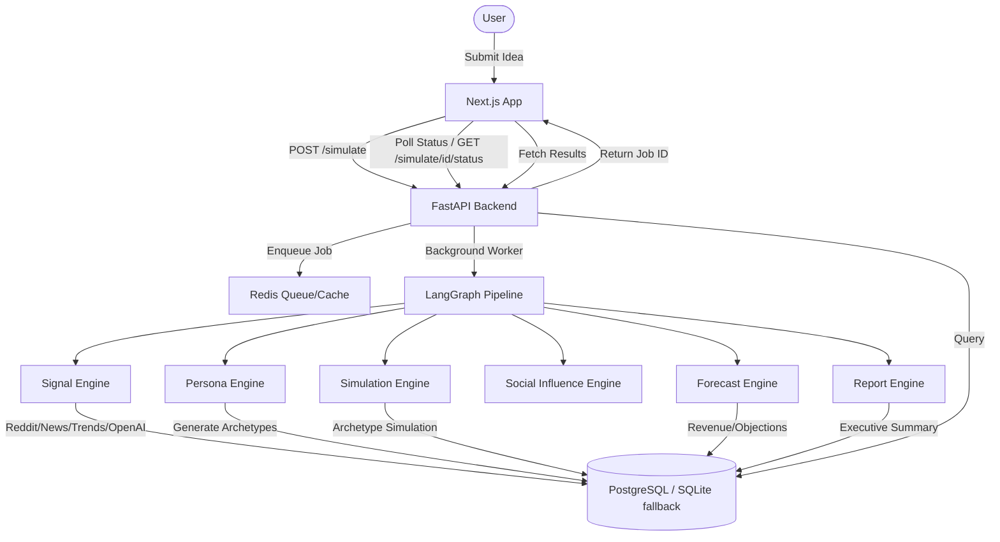

# AURA (AI Unified Risk & Revenue Analysis)

AURA is a high-fidelity, production-quality hackathon MVP designed for synthetic market simulation. It allows creators and builders to submit a product idea and receive simulated market feedback derived from 5,000 AI-generated personas grounded in real-world signal data scraped from Reddit, Google Trends, and global news feeds.

## Core Features

- **Sequential Agentic Pipeline**: Orchestrated via LangGraph, running across 6 specialized async engines:
  - **Signal Engine**: Scrapes public Reddit posts, Google Trends, and GNews articles, synthesizes them using structured LLM extraction, and caches results to Redis.
  - **Persona Engine**: Generates 60-100 high-fidelity persona archetypes grounded in the social signals.
  - **Simulation Engine**: Evaluates product adoption, pricing objections, and excitement levels for each archetype using concurrent async LLM evaluations.
  - **Social Influence Engine**: Models word-of-mouth diffusion over 5 cycles using a mathematical agent-based model.
  - **Forecast Engine**: Estimates Addressable Market Size and projects 3/6/12-month expected growth ranges.
  - **Report Engine**: Compiles executive reports, launch recommendations, quotes, and risk matrices.
- **Lazy Statistical Expansion**: To ensure performance and keep real LLM costs bounded, archetypes are expanded to 5,000 personas on-demand using a seeded pseudo-random generator, allowing instant paginated queries.
- **Palantir-Inspired Dark UI**: Deep dark background (#06060c), grid textures, terminal scanlines, high-contrast monospace accents, and Framer Motion staggered entrances.
- **Zero-Config Mock Mode**: Bypasses all external API calls (OpenAI, Reddit, News, Google Trends) and yields realistic template-driven data, allowing the entire MVP to run out-of-the-box.

---

## System Architecture



---

## Technical Stack

- **Frontend**: Next.js 15 (App Router, TypeScript), Tailwind CSS, Framer Motion, Recharts
- **Backend**: FastAPI (Python 3.11+), async throughout
- **Database**: PostgreSQL (via SQLAlchemy + asyncpg) with dynamic SQLite fallback (`aiosqlite` + `greenlet`) for seamless local development
- **Cache/Queue**: Redis (falls back to in-memory dictionary if Redis is down)
- **AI Orchestration**: LangGraph, OpenAI (using beta Structured Output API)

---

## Getting Started

### 1. Environment Setup

Copy `.env.example` to `.env`:
```bash
cp .env.example .env
```

If you wish to test real API calls, fill in the following:
- `MOCK_MODE=false`
- `OPENAI_API_KEY=your-openai-api-key`
- `NEWS_API_KEY=your-news-api-key` (from GNews free tier)

Otherwise, keep `MOCK_MODE=true` to test the MVP instantly without any keys.

### 2. Run Backend API Server

Ensure Python 3.11+ is installed. Install packages:
```bash
pip install -r backend/requirements.txt aiosqlite greenlet
```

Start the uvicorn API server:
```bash
python3 -m uvicorn backend.app.main:app --host 0.0.0.0 --port 8000
```
*Note: If PostgreSQL and Redis are not running, the backend will automatically output fallbacks (SQLite database `aura_db.sqlite` and local in-memory store) so the app runs without any errors.*

### 3. Run Frontend Server

Ensure Node.js 18+ is installed. Navigate to the `frontend` folder and install dependencies:
```bash
cd frontend
npm install
```

Start the Next.js development server:
```bash
npm run dev
```

Open [http://localhost:3000](http://localhost:3000) in your browser.

### 4. Running Integration Tests

To verify that the simulation pipeline runs end-to-end and outputs structured market reports:
```bash
python3 backend/app/tests/run_mock_pipeline.py
```

---

## Known Limitations

1. **Google Trends Rate Limits**: Google Trends queries via `pytrends` can be heavily rate-limited (HTTP 429). The system automatically falls back to synthetic trends data if a rate limit is hit.
2. **Reddit User-Agent blocks**: Reddit JSON API requires unique headers. The Signal Engine sets a custom User-Agent, but high frequency requests might trigger blocks.
3. **In-Memory Redis fallback**: When running without Redis, job status caching is stored locally in-memory. In a multi-worker production server, a shared Redis instance is required to prevent state mismatches.
